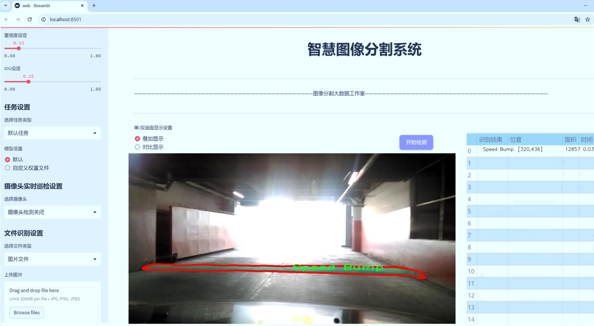
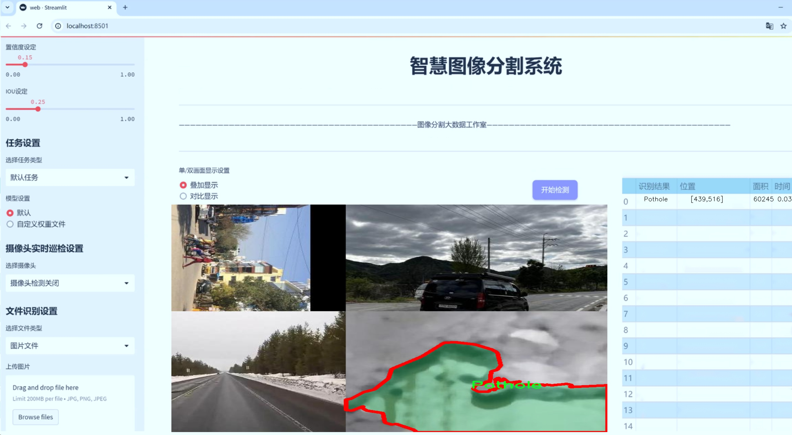
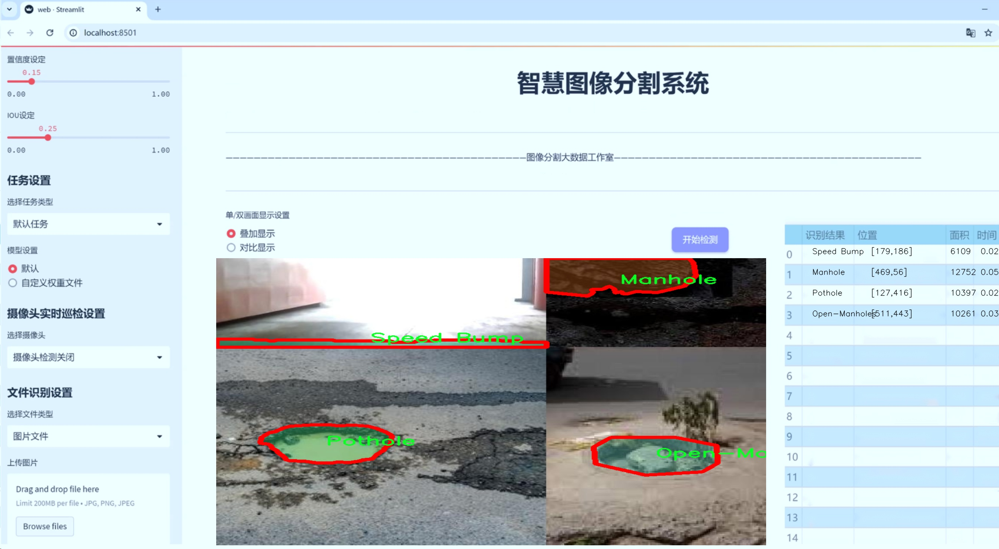
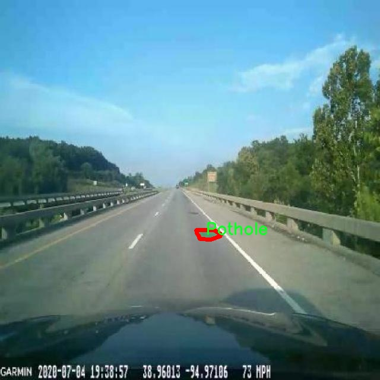
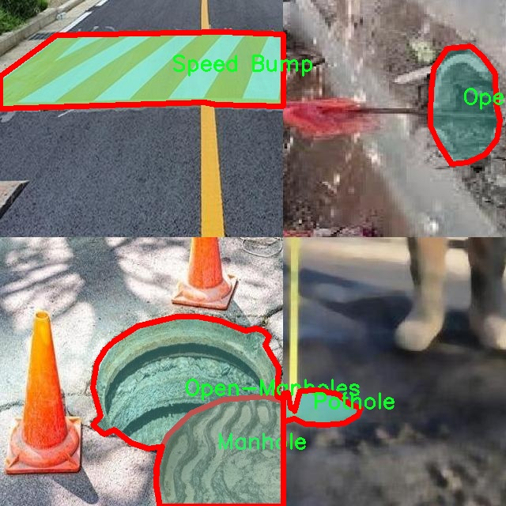
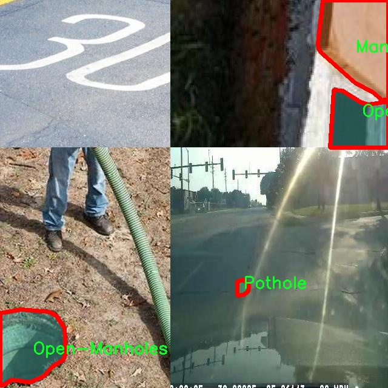
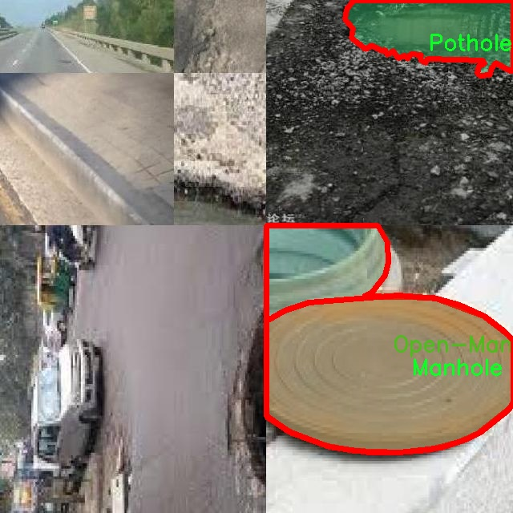
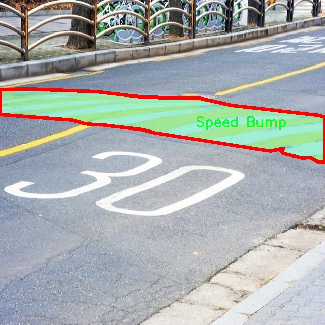

# 道路异常检测分割系统： yolov8-seg-C2f-DCNV3

### 1.研究背景与意义

[参考博客](https://gitee.com/YOLOv8_YOLOv11_Segmentation_Studio/projects)

[博客来源](https://kdocs.cn/l/cszuIiCKVNis)

研究背景与意义

随着城市化进程的加快，城市道路的维护与管理日益成为社会关注的焦点。道路异常现象，如井盖、坑洼、减速带等，不仅影响了城市的交通效率，还对行车安全和行人出行造成了潜在威胁。因此，及时、准确地检测和识别这些道路异常，成为城市管理者亟需解决的问题。传统的道路异常检测方法多依赖人工巡查，效率低下且容易受到主观因素的影响，难以实现全面、系统的监测。因此，基于计算机视觉和深度学习技术的自动化检测系统应运而生，成为提升道路管理效率的重要手段。

在众多深度学习模型中，YOLO（You Only Look Once）系列因其实时性和高效性，广泛应用于目标检测领域。YOLOv8作为该系列的最新版本，结合了多种先进的网络结构和算法，具有更强的特征提取能力和更快的推理速度。然而，针对道路异常检测的具体需求，YOLOv8仍存在一定的局限性，尤其是在复杂场景下的实例分割能力。因此，改进YOLOv8以适应道路异常检测的特定任务，具有重要的理论和实践意义。

本研究旨在基于改进的YOLOv8模型，构建一个高效的道路异常检测分割系统。我们将利用包含8300张图像的道路异常数据集，该数据集涵盖了8个类别的异常情况，包括井盖、开口井盖、坑洼、减速带、未标记的减速带等。这些类别的多样性为模型的训练提供了丰富的样本，能够有效提升模型的泛化能力和准确性。通过对数据集的深入分析和处理，我们将探索如何通过数据增强、模型结构优化等手段，提升YOLOv8在道路异常检测中的表现。

此外，研究的意义还体现在以下几个方面：首先，提升道路异常检测的自动化水平，减少人工巡查的工作量，降低人力成本，提高工作效率。其次，通过实时监测和反馈机制，及时发现和处理道路异常，降低交通事故发生率，保障行车安全。最后，研究成果将为城市管理者提供科学的决策依据，推动智能交通系统的发展，为构建智慧城市贡献力量。

综上所述，基于改进YOLOv8的道路异常检测分割系统的研究，不仅具有重要的学术价值，也为实际应用提供了切实可行的解决方案。通过深入探讨和研究，我们期望能够为道路异常检测领域带来新的突破，推动相关技术的进步与应用。

### 2.图片演示







注意：本项目提供完整的训练源码数据集和训练教程,由于此博客编辑较早,暂不提供权重文件（best.pt）,需要按照6.训练教程进行训练后实现上图效果。

### 3.视频演示

[3.1 视频演示](https://www.bilibili.com/video/BV1SPm9YdELV/)

### 4.数据集信息

##### 4.1 数据集类别数＆类别名

nc: 8
names: ['0', 'Manhole', 'Open-Manholes', 'Pothole', 'Speed Bump', 'Unmarked Bump', 'object', 'pothole']


##### 4.2 数据集信息简介

数据集信息展示

在本研究中，我们使用了名为“Road Anomalies”的数据集，以支持改进YOLOv8-seg的道路异常检测分割系统的训练与验证。该数据集专门针对道路表面异常现象进行标注，涵盖了多种可能影响交通安全和行驶舒适度的异常情况。数据集的设计初衷是为了解决城市交通管理中普遍存在的道路维护问题，帮助相关部门及时发现和处理道路缺陷，从而提高行车安全性和道路使用效率。

“Road Anomalies”数据集包含8个类别，具体类别包括：0（背景）、Manhole（井盖）、Open-Manholes（打开的井盖）、Pothole（坑洼）、Speed Bump（减速带）、Unmarked Bump（未标记的隆起）、object（其他物体）以及pothole（坑洼，可能与Pothole类别重复）。这些类别的划分不仅考虑了常见的道路异常，还特别关注了不同类型的坑洼和隆起现象，以便于模型在实际应用中能够准确识别和分类各种道路问题。

数据集中每个类别的样本数量经过精心设计，以确保模型训练的均衡性和有效性。背景类别（0）作为基础类别，包含了大量的正常道路图像，以帮助模型学习到正常情况下的道路特征。井盖和打开的井盖类别则重点标注了城市道路中常见的基础设施，尤其是在城市环境中，这些元素的状态直接影响到行车安全。坑洼和减速带类别则是道路异常检测的核心，标注了各种深度和形状的坑洼以及不同类型的减速带，以便模型能够在不同场景下进行准确识别。

此外，数据集中还包含了未标记的隆起和其他物体类别，这些类别的设置旨在提升模型的鲁棒性，使其能够处理复杂的道路环境。通过对这些异常情况的详细标注，数据集为YOLOv8-seg模型的训练提供了丰富的样本，使其能够在实际应用中更好地适应不同的道路条件。

数据集的图像采集过程涵盖了多种天气和光照条件，以确保模型在各种环境下的表现都能达到预期效果。数据集中的图像经过专业的标注工具进行处理，确保每个异常的边界和特征都被准确标识。通过这种方式，研究团队能够获得高质量的训练数据，从而提升模型的分割精度和检测能力。

总之，“Road Anomalies”数据集为改进YOLOv8-seg的道路异常检测分割系统提供了坚实的基础。通过对多种道路异常的全面覆盖，该数据集不仅为模型的训练提供了丰富的样本，也为后续的模型评估和优化奠定了基础。未来，我们希望通过进一步的研究和数据集扩展，能够不断提升道路异常检测的准确性和实用性，为城市交通管理提供更为有效的技术支持。











### 5.项目依赖环境部署教程（零基础手把手教学）

[5.1 环境部署教程链接（零基础手把手教学）](https://www.bilibili.com/video/BV1jG4Ve4E9t/?vd_source=bc9aec86d164b67a7004b996143742dc)


[5.2 安装Python虚拟环境创建和依赖库安装视频教程链接（零基础手把手教学）](https://www.bilibili.com/video/BV1nA4VeYEze/?vd_source=bc9aec86d164b67a7004b996143742dc)

### 6.手把手YOLOV8-seg训练视频教程（零基础手把手教学）

[6.1 手把手YOLOV8-seg训练视频教程（零基础小白有手就能学会）](https://www.bilibili.com/video/BV1cA4VeYETe/?vd_source=bc9aec86d164b67a7004b996143742dc)


按照上面的训练视频教程链接加载项目提供的数据集，运行train.py即可开始训练



     Epoch   gpu_mem       box       obj       cls    labels  img_size
     1/200     0G   0.01576   0.01955  0.007536        22      1280: 100%|██████████| 849/849 [14:42<00:00,  1.04s/it]
               Class     Images     Labels          P          R     mAP@.5 mAP@.5:.95: 100%|██████████| 213/213 [01:14<00:00,  2.87it/s]
                 all       3395      17314      0.994      0.957      0.0957      0.0843

     Epoch   gpu_mem       box       obj       cls    labels  img_size
     2/200     0G   0.01578   0.01923  0.007006        22      1280: 100%|██████████| 849/849 [14:44<00:00,  1.04s/it]
               Class     Images     Labels          P          R     mAP@.5 mAP@.5:.95: 100%|██████████| 213/213 [01:12<00:00,  2.95it/s]
                 all       3395      17314      0.996      0.956      0.0957      0.0845

     Epoch   gpu_mem       box       obj       cls    labels  img_size
     3/200     0G   0.01561    0.0191  0.006895        27      1280: 100%|██████████| 849/849 [10:56<00:00,  1.29it/s]
               Class     Images     Labels          P          R     mAP@.5 mAP@.5:.95: 100%|███████   | 187/213 [00:52<00:00,  4.04it/s]
                 all       3395      17314      0.996      0.957      0.0957      0.0845


### 7.50+种全套YOLOV8-seg创新点加载调参实验视频教程（一键加载写好的改进模型的配置文件）

[7.1 50+种全套YOLOV8-seg创新点加载调参实验视频教程（一键加载写好的改进模型的配置文件）](https://www.bilibili.com/video/BV1Hw4VePEXv/?vd_source=bc9aec86d164b67a7004b996143742dc)

### YOLOV8-seg算法简介

原始YOLOv8-seg算法原理

YOLOv8-seg是2023年由Ultralytics公司推出的YOLO系列算法中的一个重要变种，专注于图像分割任务。作为YOLO系列的最新版本，YOLOv8-seg不仅继承了YOLO系列一贯的高效性和实时性，还在网络结构和算法设计上进行了诸多创新，特别是在特征提取和多尺度融合方面，极大地提升了模型的性能和适用性。

首先，YOLOv8-seg的主干网络采用了CSP（Cross Stage Partial）结构，这一设计的核心思想是将特征提取过程分为两部分，分别进行卷积和连接。通过这种方式，YOLOv8-seg能够有效地减少计算量，同时保留更多的特征信息。与之前的YOLOv5算法相比，YOLOv8-seg引入了C2f模块来替代C3模块。C2f模块在设计上融合了ELAN（Efficient Layer Aggregation Network）模块的思想，增加了更多的残差连接。这种设计使得网络在保持轻量化的同时，能够获得更加丰富的梯度信息，从而提高了模型的学习能力和泛化能力。

在特征融合方面，YOLOv8-seg采用了PAN-FPN（Path Aggregation Network - Feature Pyramid Network）结构。该结构通过多尺度特征的融合，使得模型能够更好地处理不同尺寸的目标。PAN-FPN通过自下而上的路径和自上而下的路径结合，确保了高层语义信息与低层细节信息的有效结合，从而在图像分割任务中实现了更高的精度。

YOLOv8-seg的检测网络采用了Anchor-Free的检测方式，这一创新显著简化了目标检测的过程。传统的Anchor-Based方法需要手动设计锚框，而Anchor-Free方法则通过直接预测目标的位置和大小，减少了设计复杂性和计算开销。YOLOv8-seg的Detect模块使用了解耦头结构，将分类和检测任务分开处理。这种设计不仅提高了模型的灵活性，还增强了其在复杂场景下的表现能力。

在损失函数的设计上，YOLOv8-seg采用了BCELoss作为分类损失，DFLLoss和CIoULoss作为回归损失。这种多重损失函数的设计使得模型在训练过程中能够更好地平衡分类和回归任务的权重，从而提高了整体性能。尤其是在分割任务中，精确的边界预测和目标分类是至关重要的，YOLOv8-seg通过优化损失函数，确保了这两者的良好结合。

在数据增强方面，YOLOv8-seg借鉴了YOLOvX中的一些策略，特别是在训练的最后10个epoch中关闭马赛克增强。这一策略的实施使得模型在训练后期能够更加专注于特定的特征学习，从而提升了模型的稳定性和准确性。此外，YOLOv8-seg还引入了动态Task-Aligned Assigner样本分配策略，进一步优化了训练过程中的样本选择，提高了训练效率。

YOLOv8-seg的整体架构由输入端、主干网络和检测端三部分组成。输入端负责接收和预处理图像数据，主干网络则通过一系列卷积和激活操作提取特征，最后，检测端负责将提取的特征进行解码，输出目标的类别和位置。通过这种模块化的设计，YOLOv8-seg不仅实现了高效的特征提取和处理，还为后续的模型改进和扩展提供了良好的基础。

总的来说，YOLOv8-seg算法通过一系列创新设计，提升了目标检测和图像分割的性能。其在特征提取、损失函数、数据增强等方面的改进，使得YOLOv8-seg在实际应用中展现出更强的适应性和准确性。无论是在复杂场景下的实时检测，还是在细粒度的图像分割任务中，YOLOv8-seg都表现出了优异的性能，成为了计算机视觉领域中的一项重要进展。随着YOLOv8-seg的不断发展和完善，未来在各类视觉任务中的应用潜力将更加广阔。


### 9.系统功能展示（检测对象为举例，实际内容以本项目数据集为准）

图9.1.系统支持检测结果表格显示

  图9.2.系统支持置信度和IOU阈值手动调节

  图9.3.系统支持自定义加载权重文件best.pt(需要你通过步骤5中训练获得)

  图9.4.系统支持摄像头实时识别

  图9.5.系统支持图片识别

  图9.6.系统支持视频识别

  图9.7.系统支持识别结果文件自动保存

  图9.8.系统支持Excel导出检测结果数据


### 10.50+种全套YOLOV8-seg创新点原理讲解（非科班也可以轻松写刊发刊，V11版本正在科研待更新）

#### 10.1 由于篇幅限制，每个创新点的具体原理讲解就不一一展开，具体见下列网址中的创新点对应子项目的技术原理博客网址【Blog】：


[10.1 50+种全套YOLOV8-seg创新点原理讲解链接](https://gitee.com/qunmasj/good)

#### 10.2 部分改进模块原理讲解(完整的改进原理见上图和技术博客链接)【如果此小节的图加载失败可以通过CSDN或者Github搜索该博客的标题访问原始博客，原始博客图片显示正常】
### YOLOv8模型原理

YOLOv8是YOLO系列最新的模型,具有非常优秀的检测精度和速度。根据网络的深度与特征图的宽度大小, YOLOv8算法分为:YOLOv8-n、YOLOv8一s 、YOLOv8-m 、 YOLOv8-l、和 YOLOv8-x 5个版本。按照网络结构图,YOLOv8可分为: Inpul 、 Backbone , Neck和Head 4部分。


Backbone采用了CSPDarknet 架构，由CBS (标准卷积层)、C2f模块和 SPPF(金字塔池化）组成。通过5次标准卷积层和C2f模块逐步提取图像特征，并在网络末尾添加SPPF模块，将任意大小的输入图像转换成固定大小的特征向量。分别取P3、P4、P5层的特征提取结果，向Head输出80×80、40 × 40、20×20三个尺度的特征层。
C2f模块借鉴了残差网络(ResNet)以及ELAN的思想，其结构分为两个分支，主干部分利用Bottleneckm2%模块逐步加深网络，分支部分保留输入层通道并与主干部分特征进行融合，如图所示。通过标准卷积层提取新的特征层，相比于YOLOv5使用的C3模块，C2f模块可以在卷积层和全连接层之间建立一个平滑的转换，从而实现了参数的共享，提高了模型的效率和泛化能力。
Head采用了PAN-FPN 结构,将 Backbone输入的3个特征层进行多尺度融合，进行自顶向下(FAN)和自底向上 (PAN)的特征传递，对金字塔进行增强，使不同尺寸的特征图都包含强目标语义信息和强目标特征信息，保证了对不同尺寸样本的准确预测。
Detect借鉴了Decoupled-Head 思想，用一个解耦检测头将输入的不同尺寸特征层分成2个分支进行检测。第1个分支在进行3次卷积后使进行回归任务，输出预测框。第2个分支在进行3次卷积后进行分类任务，输出类别的概率。采用Varifocal_Loss2”作为损失函数，其式为:


### Context_Grided_Network(CGNet)简介
参考该博客提出的一种轻量化语义分割模型Context Grided Network(CGNet)，以满足设备的运行需要。

CGNet主要由CG块构建而成，CG块可以学习局部特征和周围环境上下文的联合特征，最后通过引入全局上下文特征进一步改善联合特征的学习。


 
下图给出了在Cityscapes数据集上对现有的一些语义分割模型的测试效果，横轴表示参数量，纵轴表示准确率(mIoU)。可以看出，在参数量较少的情况下，CGNet可以达到一个比较好的准确率。虽与高精度模型相去甚远，但在一些对精度要求不高、对实时性要求比较苛刻的情况下，很有价值。


高精度模型，如DeepLab、DFN、DenseASPP等，动不动就是几十M的参数，很难应用在移动设备上。而上图中红色的模型，相对内存占用较小，但它们的分割精度却不是很高。作者认为主要原因是，这些小网络大多遵循着分类网络的设计思路，并没有考虑语义分割任务更深层次的特点。

空间依赖性和上下文信息对提高分割精度有很大的作用。作者从该角度出发，提出了CG block，并进一步搭建了轻量级语义分割网络CGNet。CG块具有以下特点： 

学习局部特征和上下文特征的联合特征；
通过全局上下文特征改进上述联合特征；
可以贯穿应用在整个网络中，从low level（空间级别）到high level（语义级别）。不像PSPNet、DFN、DenseASPP等，只在编码阶段以后捕捉上下文特征。；
只有3个下采样，相比一般5个下采样的网络，能够更好地保留边缘信息。
CGNet遵循“深而薄”的原则设计，整个网络又51层构成。其中，为了降低计算，大量使用了channel-wise conv.

小型语义分割模型：

需要平衡准确率和系统开销
进化路线：ENet -> ICNet -> ESPNet
这些模型基本都基于分类网络设计，在分割准确率上效果并不是很好
上下文信息模型：

大多数现有模型只考虑解码阶段的上下文信息并且没有利用周围的上下文信息
注意力机制：

CG block使用全局上下文信息计算权重向量，并使用其细化局部特征和周围上下文特征的联合特征

#### Context Guided Block
CG block由4部分组成：


此外，CG block还采用了残差学习。文中提出了局部残差学习（LRL）和全局残差学习（GRL）两种方式。 LRL添加了从输入到联合特征提取器的连接，GRL添加了从输入到全局特征提取器的连接。从直观上来说，GRL比LRL更能促进网络中的信息传递（更像ResNet~~），后面实验部分也进行了测试，的确GRL更能提升分割精度。


CGNet的通用网络结构如下图所示，分为3个stage，第一个stage使用3个卷积层抽取特征，第二和第三个stage堆叠一定数量的CG block，具体个数可以根据情况调整。最后，通过1x1 conv得到分割结果。


下图是用于Cityscapes数据集的CGNet网络细节说明：输入尺寸为3*680*680；stage1连续使用了3个Conv-BN-PReLU组合，首个组合使用了stride=2的卷积，所以得到了1/2分辨率的feature map；stage2和stage3分别使用了多个CG block，且其中使用了不同大小的膨胀卷积核，最终分别得到了1/4和1/8的feature map。

需注意：

stage2&3的输入特征分别由其上一个stage的首个和最后一个block组合给出（参考上图的绿色箭头）；

输入注入机制，图中未体现，实际使用中，作者还将输入图像下采样1/4或1/8，分别给到stage2和stage3的输入中 ，以进一步加强特征传递。

channel-wise conv。为了缩减参数数量，在局部特征提取器和周围上下文特征提取器中使用了channel-wise卷积，可以消除跨通道的计算成本，同时节省内存占用。但是，没有像MobileNet等模型一样，在depth-wise卷积后面接point-wise卷积（1*1 conv），作者解释是，因为CG block需要保持局部特征和周围上下文特征的独立性，而1*1 conv会破坏这种独立性，所以效果欠佳，实验部分也进行了验证。

个人感觉此处应该指的是depth-wise卷积？

官方Git中对该部分的实现如下：


### 11.项目核心源码讲解（再也不用担心看不懂代码逻辑）

#### 11.1 ultralytics\utils\instance.py

以下是对给定代码的核心部分进行分析和详细注释的结果。保留了主要的类和方法，并添加了中文注释，以便更好地理解其功能和用途。

```python
# Ultralytics YOLO 🚀, AGPL-3.0 license

import numpy as np
from collections import abc
from itertools import repeat
from numbers import Number
from typing import List

# 定义一个函数用于将输入转换为n元组
def _ntuple(n):
    """将输入转换为n元组的函数。"""
    def parse(x):
        """解析边界框格式，支持可迭代对象或单一值。"""
        return x if isinstance(x, abc.Iterable) else tuple(repeat(x, n))
    return parse

# 定义将输入转换为2元组和4元组的函数
to_2tuple = _ntuple(2)
to_4tuple = _ntuple(4)

# 定义支持的边界框格式
_formats = ['xyxy', 'xywh', 'ltwh']

class Bboxes:
    """
    处理边界框的类，支持多种格式（'xyxy', 'xywh', 'ltwh'）。
    """

    def __init__(self, bboxes, format='xyxy') -> None:
        """初始化Bboxes类，设置边界框数据和格式。"""
        assert format in _formats, f'无效的边界框格式: {format}, 必须是 {_formats} 中的一种'
        bboxes = bboxes[None, :] if bboxes.ndim == 1 else bboxes
        assert bboxes.ndim == 2
        assert bboxes.shape[1] == 4
        self.bboxes = bboxes  # 存储边界框的numpy数组
        self.format = format  # 边界框的格式

    def convert(self, format):
        """将边界框格式从一种类型转换为另一种类型。"""
        assert format in _formats, f'无效的边界框格式: {format}, 必须是 {_formats} 中的一种'
        if self.format == format:
            return
        # 根据当前格式和目标格式选择转换函数
        func = self._get_conversion_function(format)
        self.bboxes = func(self.bboxes)  # 转换边界框
        self.format = format  # 更新格式

    def _get_conversion_function(self, format):
        """根据当前格式和目标格式返回相应的转换函数。"""
        if self.format == 'xyxy':
            return xyxy2xywh if format == 'xywh' else xyxy2ltwh
        elif self.format == 'xywh':
            return xywh2xyxy if format == 'xyxy' else xywh2ltwh
        else:
            return ltwh2xyxy if format == 'xyxy' else ltwh2xywh

    def areas(self):
        """返回每个边界框的面积。"""
        self.convert('xyxy')  # 确保转换为xyxy格式
        return (self.bboxes[:, 2] - self.bboxes[:, 0]) * (self.bboxes[:, 3] - self.bboxes[:, 1])  # 计算面积

    def mul(self, scale):
        """按比例缩放边界框坐标。"""
        if isinstance(scale, Number):
            scale = to_4tuple(scale)  # 转换为4元组
        assert isinstance(scale, (tuple, list)) and len(scale) == 4
        self.bboxes[:, 0] *= scale[0]  # 左上角x坐标
        self.bboxes[:, 1] *= scale[1]  # 左上角y坐标
        self.bboxes[:, 2] *= scale[2]  # 右下角x坐标
        self.bboxes[:, 3] *= scale[3]  # 右下角y坐标

    def add(self, offset):
        """为边界框坐标添加偏移量。"""
        if isinstance(offset, Number):
            offset = to_4tuple(offset)  # 转换为4元组
        assert isinstance(offset, (tuple, list)) and len(offset) == 4
        self.bboxes[:, 0] += offset[0]  # 左上角x坐标
        self.bboxes[:, 1] += offset[1]  # 左上角y坐标
        self.bboxes[:, 2] += offset[2]  # 右下角x坐标
        self.bboxes[:, 3] += offset[3]  # 右下角y坐标

    def __len__(self):
        """返回边界框的数量。"""
        return len(self.bboxes)

    @classmethod
    def concatenate(cls, boxes_list: List['Bboxes'], axis=0) -> 'Bboxes':
        """
        将多个Bboxes对象合并为一个Bboxes对象。
        """
        assert isinstance(boxes_list, (list, tuple))
        if not boxes_list:
            return cls(np.empty(0))
        assert all(isinstance(box, Bboxes) for box in boxes_list)

        if len(boxes_list) == 1:
            return boxes_list[0]
        return cls(np.concatenate([b.bboxes for b in boxes_list], axis=axis))  # 合并边界框

    def __getitem__(self, index) -> 'Bboxes':
        """
        使用索引获取特定的边界框或一组边界框。
        """
        if isinstance(index, int):
            return Bboxes(self.bboxes[index].view(1, -1))  # 返回单个边界框
        b = self.bboxes[index]
        assert b.ndim == 2, f'索引 {index} 返回的结果不是二维矩阵!'
        return Bboxes(b)  # 返回选定的边界框

class Instances:
    """
    存储图像中检测到的对象的边界框、分段和关键点的容器。
    """

    def __init__(self, bboxes, segments=None, keypoints=None, bbox_format='xywh', normalized=True) -> None:
        """
        初始化Instances对象，设置边界框、分段和关键点。
        """
        if segments is None:
            segments = []
        self._bboxes = Bboxes(bboxes=bboxes, format=bbox_format)  # 创建Bboxes对象
        self.keypoints = keypoints  # 关键点
        self.normalized = normalized  # 是否归一化

        # 处理分段数据
        if len(segments) > 0:
            segments = resample_segments(segments)  # 重采样分段
            segments = np.stack(segments, axis=0)  # 堆叠分段
        else:
            segments = np.zeros((0, 1000, 2), dtype=np.float32)  # 初始化为空分段
        self.segments = segments  # 存储分段数据

    def convert_bbox(self, format):
        """转换边界框格式。"""
        self._bboxes.convert(format=format)

    @property
    def bbox_areas(self):
        """计算边界框的面积。"""
        return self._bboxes.areas()

    def scale(self, scale_w, scale_h, bbox_only=False):
        """按比例缩放边界框、分段和关键点。"""
        self._bboxes.mul(scale=(scale_w, scale_h, scale_w, scale_h))  # 缩放边界框
        if bbox_only:
            return
        self.segments[..., 0] *= scale_w  # 缩放分段x坐标
        self.segments[..., 1] *= scale_h  # 缩放分段y坐标
        if self.keypoints is not None:
            self.keypoints[..., 0] *= scale_w  # 缩放关键点x坐标
            self.keypoints[..., 1] *= scale_h  # 缩放关键点y坐标

    def denormalize(self, w, h):
        """将归一化的坐标转换为绝对坐标。"""
        if not self.normalized:
            return
        self._bboxes.mul(scale=(w, h, w, h))  # 缩放边界框
        self.segments[..., 0] *= w  # 缩放分段x坐标
        self.segments[..., 1] *= h  # 缩放分段y坐标
        if self.keypoints is not None:
            self.keypoints[..., 0] *= w  # 缩放关键点x坐标
            self.keypoints[..., 1] *= h  # 缩放关键点y坐标
        self.normalized = False  # 更新归一化状态

    def normalize(self, w, h):
        """将绝对坐标转换为归一化坐标。"""
        if self.normalized:
            return
        self._bboxes.mul(scale=(1 / w, 1 / h, 1 / w, 1 / h))  # 缩放边界框
        self.segments[..., 0] /= w  # 归一化分段x坐标
        self.segments[..., 1] /= h  # 归一化分段y坐标
        if self.keypoints is not None:
            self.keypoints[..., 0] /= w  # 归一化关键点x坐标
            self.keypoints[..., 1] /= h  # 归一化关键点y坐标
        self.normalized = True  # 更新归一化状态

    def __getitem__(self, index) -> 'Instances':
        """
        使用索引获取特定实例或一组实例。
        """
        segments = self.segments[index] if len(self.segments) else self.segments
        keypoints = self.keypoints[index] if self.keypoints is not None else None
        bboxes = self.bboxes[index]
        bbox_format = self._bboxes.format
        return Instances(
            bboxes=bboxes,
            segments=segments,
            keypoints=keypoints,
            bbox_format=bbox_format,
            normalized=self.normalized,
        )

    def __len__(self):
        """返回实例的数量。"""
        return len(self.bboxes)

    @classmethod
    def concatenate(cls, instances_list: List['Instances'], axis=0) -> 'Instances':
        """
        将多个Instances对象合并为一个Instances对象。
        """
        assert isinstance(instances_list, (list, tuple))
        if not instances_list:
            return cls(np.empty(0))
        assert all(isinstance(instance, Instances) for instance in instances_list)

        if len(instances_list) == 1:
            return instances_list[0]

        use_keypoint = instances_list[0].keypoints is not None
        bbox_format = instances_list[0]._bboxes.format
        normalized = instances_list[0].normalized

        cat_boxes = np.concatenate([ins.bboxes for ins in instances_list], axis=axis)  # 合并边界框
        cat_segments = np.concatenate([b.segments for b in instances_list], axis=axis)  # 合并分段
        cat_keypoints = np.concatenate([b.keypoints for b in instances_list], axis=axis) if use_keypoint else None  # 合并关键点
        return cls(cat_boxes, cat_segments, cat_keypoints, bbox_format, normalized)  # 返回合并后的Instances对象

    @property
    def bboxes(self):
        """返回边界框。"""
        return self._bboxes.bboxes
```

### 代码分析
1. **Bboxes类**: 该类用于处理边界框，支持多种格式（`xyxy`, `xywh`, `ltwh`）。它提供了初始化、格式转换、面积计算、缩放、添加偏移等功能。

2. **Instances类**: 该类用于存储图像中检测到的对象的边界框、分段和关键点。它支持归一化和反归一化操作，并提供了合并多个实例的方法。

3. **方法功能**:
   - `convert`: 将边界框格式进行转换。
   - `areas`: 计算每个边界框的面积。
   - `mul`和`add`: 用于缩放和偏移边界框坐标。
   - `scale`, `normalize`, `denormalize`: 处理坐标的缩放和归一化。
   - `concatenate`: 合并多个边界框或实例对象。

这些类和方法为计算机视觉任务中的目标检测提供了基础的边界框处理功能。

这个文件定义了两个主要的类：`Bboxes`和`Instances`，用于处理图像中的边界框（bounding boxes）、分段（segments）和关键点（keypoints）。这些类是Ultralytics YOLO（You Only Look Once）目标检测框架的一部分，旨在简化和优化与边界框相关的操作。

`Bboxes`类主要用于管理边界框，支持多种格式，包括`xyxy`（左上角和右下角坐标）、`xywh`（中心坐标和宽高）以及`ltwh`（左上角坐标和宽高）。在初始化时，`Bboxes`类会检查输入的边界框格式是否有效，并确保输入数据是一个二维的NumPy数组。该类提供了多种方法来转换边界框格式、计算面积、缩放和偏移边界框等操作。它还支持通过索引获取特定的边界框，并可以将多个`Bboxes`对象合并为一个。

`Instances`类则是一个更高级的容器，除了包含边界框外，还可以存储与检测到的对象相关的分段和关键点。它的构造函数接收边界框、分段和关键点，并对分段进行重采样以确保其形状一致。`Instances`类提供了多种方法来转换边界框格式、缩放、归一化和去归一化边界框等。它还可以通过索引获取特定的实例，并提供翻转和裁剪操作，以确保边界框和其他数据在图像边界内。

整体而言，这个文件为处理目标检测中的边界框、分段和关键点提供了一个灵活且高效的工具集，使得用户能够方便地进行各种操作和转换。通过这些类，用户可以轻松地管理和操作图像中的目标检测结果，进而应用于后续的分析或处理。

#### 11.2 ultralytics\models\yolo\detect\train.py

以下是经过简化和注释的核心代码部分，主要关注于YOLO检测模型的训练过程：

```python
# 导入必要的库
from copy import copy
import numpy as np
from ultralytics.data import build_dataloader, build_yolo_dataset
from ultralytics.engine.trainer import BaseTrainer
from ultralytics.models import yolo
from ultralytics.nn.tasks import DetectionModel
from ultralytics.utils import LOGGER, RANK
from ultralytics.utils.plotting import plot_images, plot_labels, plot_results
from ultralytics.utils.torch_utils import de_parallel, torch_distributed_zero_first

class DetectionTrainer(BaseTrainer):
    """
    扩展自BaseTrainer类的检测模型训练类。
    """

    def build_dataset(self, img_path, mode='train', batch=None):
        """
        构建YOLO数据集。

        参数:
            img_path (str): 包含图像的文件夹路径。
            mode (str): 模式，'train'或'val'，用于不同的数据增强。
            batch (int, optional): 批次大小，仅用于'rect'模式。
        """
        # 获取模型的最大步幅
        gs = max(int(de_parallel(self.model).stride.max() if self.model else 0), 32)
        # 构建YOLO数据集
        return build_yolo_dataset(self.args, img_path, batch, self.data, mode=mode, rect=mode == 'val', stride=gs)

    def get_dataloader(self, dataset_path, batch_size=16, rank=0, mode='train'):
        """构造并返回数据加载器。"""
        assert mode in ['train', 'val']  # 确保模式有效
        with torch_distributed_zero_first(rank):  # 在分布式训练中，确保数据集只初始化一次
            dataset = self.build_dataset(dataset_path, mode, batch_size)
        shuffle = mode == 'train'  # 训练模式下打乱数据
        if getattr(dataset, 'rect', False) and shuffle:
            LOGGER.warning("WARNING ⚠️ 'rect=True'与DataLoader的shuffle不兼容，设置shuffle=False")
            shuffle = False
        workers = self.args.workers if mode == 'train' else self.args.workers * 2  # 设置工作线程数
        return build_dataloader(dataset, batch_size, workers, shuffle, rank)  # 返回数据加载器

    def preprocess_batch(self, batch):
        """对图像批次进行预处理，缩放并转换为浮点数。"""
        batch['img'] = batch['img'].to(self.device, non_blocking=True).float() / 255  # 将图像归一化到[0, 1]
        return batch

    def set_model_attributes(self):
        """设置模型的属性，包括类别数量和名称。"""
        self.model.nc = self.data['nc']  # 将类别数量附加到模型
        self.model.names = self.data['names']  # 将类别名称附加到模型
        self.model.args = self.args  # 将超参数附加到模型

    def get_model(self, cfg=None, weights=None, verbose=True):
        """返回YOLO检测模型。"""
        model = DetectionModel(cfg, nc=self.data['nc'], verbose=verbose and RANK == -1)  # 创建检测模型
        if weights:
            model.load(weights)  # 加载权重
        return model

    def plot_training_samples(self, batch, ni):
        """绘制训练样本及其注释。"""
        plot_images(images=batch['img'],
                    batch_idx=batch['batch_idx'],
                    cls=batch['cls'].squeeze(-1),
                    bboxes=batch['bboxes'],
                    paths=batch['im_file'],
                    fname=self.save_dir / f'train_batch{ni}.jpg',
                    on_plot=self.on_plot)

    def plot_metrics(self):
        """从CSV文件绘制指标。"""
        plot_results(file=self.csv, on_plot=self.on_plot)  # 保存结果图
```

### 代码注释说明：
1. **类定义**：`DetectionTrainer`类用于训练YOLO检测模型，继承自`BaseTrainer`。
2. **构建数据集**：`build_dataset`方法根据给定的图像路径和模式构建YOLO数据集。
3. **获取数据加载器**：`get_dataloader`方法创建并返回数据加载器，支持分布式训练。
4. **预处理批次**：`preprocess_batch`方法对输入图像进行归一化处理。
5. **设置模型属性**：`set_model_attributes`方法将类别数量和名称等信息附加到模型上。
6. **获取模型**：`get_model`方法返回一个YOLO检测模型实例，并可选择加载预训练权重。
7. **绘制训练样本**：`plot_training_samples`方法用于可视化训练样本及其对应的标签。
8. **绘制指标**：`plot_metrics`方法用于从CSV文件中绘制训练过程中的指标。

以上代码片段保留了YOLO模型训练的核心逻辑，并提供了详细的中文注释以帮助理解。

这个程序文件是Ultralytics YOLO（You Only Look Once）模型的训练模块，主要用于目标检测任务。文件中定义了一个名为`DetectionTrainer`的类，该类继承自`BaseTrainer`，用于处理与YOLO模型相关的训练过程。

在文件开头，导入了一些必要的库和模块，包括用于数据处理的`build_dataloader`和`build_yolo_dataset`，用于训练的`BaseTrainer`，以及YOLO模型和相关工具的模块。

`DetectionTrainer`类中包含多个方法，首先是`build_dataset`方法，该方法用于构建YOLO数据集。它接受图像路径、模式（训练或验证）和批量大小作为参数，使用`build_yolo_dataset`函数来创建数据集。该方法还会根据模型的步幅（stride）设置一些参数。

接下来是`get_dataloader`方法，它用于构建和返回数据加载器。该方法会根据传入的模式（训练或验证）来初始化数据集，并根据需要设置数据加载的随机性（shuffle）。如果在验证模式下，设置了`rect`参数为True，则会发出警告，因为这与数据加载器的随机性不兼容。

`preprocess_batch`方法用于对一批图像进行预处理，包括将图像转换为浮点数并缩放到0到1之间。

`set_model_attributes`方法用于设置模型的属性，包括类别数量和类别名称等。它会将数据集中的类别信息附加到模型上。

`get_model`方法用于返回一个YOLO检测模型，可以选择加载预训练权重。

`get_validator`方法返回一个用于YOLO模型验证的`DetectionValidator`实例，该实例会跟踪损失值（如边界框损失、分类损失等）。

`label_loss_items`方法用于返回带有标签的训练损失项字典，方便在训练过程中监控损失值。

`progress_string`方法返回一个格式化的字符串，显示训练进度，包括当前的epoch、GPU内存使用情况、损失值、实例数量和图像大小等信息。

`plot_training_samples`方法用于绘制训练样本及其注释，包括图像、类别和边界框等信息，并将结果保存为图像文件。

最后，`plot_metrics`和`plot_training_labels`方法分别用于绘制训练过程中的指标和标签图。这些方法通过调用相应的绘图函数，将训练过程中的重要信息可视化，便于分析和调试。

总体来说，这个文件实现了YOLO模型的训练流程，包括数据集构建、数据加载、模型设置、损失监控和结果可视化等功能，是进行目标检测任务的重要组成部分。

#### 11.3 ultralytics\models\fastsam\prompt.py

以下是经过简化和注释的核心代码部分，主要集中在图像分割和可视化的功能上：

```python
import os
import numpy as np
import torch
from PIL import Image
import cv2
from ultralytics.utils import TQDM

class FastSAMPrompt:
    """
    Fast Segment Anything Model类，用于图像注释和可视化。
    """

    def __init__(self, source, results, device='cuda') -> None:
        """初始化FastSAMPrompt，设置源图像、结果和计算设备。"""
        self.device = device
        self.results = results
        self.source = source

        # 导入CLIP模型
        try:
            import clip  # 用于线性分配
        except ImportError:
            from ultralytics.utils.checks import check_requirements
            check_requirements('git+https://github.com/openai/CLIP.git')
            import clip
        self.clip = clip

    @staticmethod
    def _segment_image(image, bbox):
        """根据提供的边界框坐标对图像进行分割。"""
        image_array = np.array(image)
        segmented_image_array = np.zeros_like(image_array)  # 创建与原图相同大小的全黑图像
        x1, y1, x2, y2 = bbox
        segmented_image_array[y1:y2, x1:x2] = image_array[y1:y2, x1:x2]  # 仅保留边界框内的区域
        segmented_image = Image.fromarray(segmented_image_array)
        black_image = Image.new('RGB', image.size, (255, 255, 255))  # 创建白色背景图
        transparency_mask = np.zeros((image_array.shape[0], image_array.shape[1]), dtype=np.uint8)
        transparency_mask[y1:y2, x1:x2] = 255  # 设置透明度掩码
        transparency_mask_image = Image.fromarray(transparency_mask, mode='L')
        black_image.paste(segmented_image, mask=transparency_mask_image)  # 将分割图像粘贴到白色背景上
        return black_image

    @staticmethod
    def _format_results(result, filter=0):
        """将检测结果格式化为包含ID、分割、边界框、分数和面积的注释列表。"""
        annotations = []
        n = len(result.masks.data) if result.masks is not None else 0
        for i in range(n):
            mask = result.masks.data[i] == 1.0
            if torch.sum(mask) >= filter:  # 根据过滤条件筛选
                annotation = {
                    'id': i,
                    'segmentation': mask.cpu().numpy(),
                    'bbox': result.boxes.data[i],
                    'score': result.boxes.conf[i]
                }
                annotation['area'] = annotation['segmentation'].sum()  # 计算面积
                annotations.append(annotation)
        return annotations

    def plot(self, annotations, output):
        """
        在图像上绘制注释、边界框，并保存输出。
        """
        pbar = TQDM(annotations, total=len(annotations))
        for ann in pbar:
            result_name = os.path.basename(ann.path)
            image = ann.orig_img[..., ::-1]  # BGR转RGB
            plt.figure(figsize=(image.shape[1] / 100, image.shape[0] / 100))
            plt.imshow(image)

            if ann.masks is not None:
                masks = ann.masks.data
                for mask in masks:
                    mask = mask.astype(np.uint8)
                    plt.imshow(mask, alpha=0.5)  # 以半透明方式显示掩码

            # 保存图像
            save_path = os.path.join(output, result_name)
            plt.axis('off')
            plt.savefig(save_path, bbox_inches='tight', pad_inches=0, transparent=True)
            plt.close()
            pbar.set_description(f'Saving {result_name} to {save_path}')

    @torch.no_grad()
    def retrieve(self, model, preprocess, elements, search_text: str) -> int:
        """处理图像和文本，计算相似度，并返回softmax分数。"""
        preprocessed_images = [preprocess(image).to(self.device) for image in elements]
        tokenized_text = self.clip.tokenize([search_text]).to(self.device)
        stacked_images = torch.stack(preprocessed_images)
        image_features = model.encode_image(stacked_images)
        text_features = model.encode_text(tokenized_text)
        image_features /= image_features.norm(dim=-1, keepdim=True)
        text_features /= text_features.norm(dim=-1, keepdim=True)
        probs = 100.0 * image_features @ text_features.T
        return probs[:, 0].softmax(dim=0)

    def everything_prompt(self):
        """返回处理后的结果。"""
        return self.results
```

### 代码说明：
1. **类定义**：`FastSAMPrompt`类用于图像分割和可视化。
2. **初始化方法**：设置设备、源图像和结果，并导入CLIP模型。
3. **图像分割**：`_segment_image`方法根据边界框对图像进行分割，并返回分割后的图像。
4. **结果格式化**：`_format_results`方法将检测结果格式化为包含必要信息的注释列表。
5. **绘图方法**：`plot`方法在图像上绘制分割掩码和边界框，并保存结果。
6. **检索方法**：`retrieve`方法处理图像和文本，计算相似度并返回分数。
7. **获取结果**：`everything_prompt`方法返回处理后的结果。

这个程序文件定义了一个名为 `FastSAMPrompt` 的类，主要用于图像注释和可视化，特别是在图像分割和目标检测的上下文中。类的构造函数接收源图像、检测结果和计算设备（如 CPU 或 GPU），并尝试导入 CLIP 模型以进行线性分配。

类中包含多个静态方法和实例方法。静态方法 `_segment_image` 用于根据给定的边界框坐标对图像进行分割，生成一个透明背景的图像。`_format_results` 方法将检测结果格式化为包含 ID、分割掩码、边界框、置信度分数和面积的注释列表。`_get_bbox_from_mask` 方法通过对掩码应用形态学变换来获取边界框。

`plot` 方法用于在图像上绘制注释、边界框和点，并将结果保存到指定的输出目录。该方法支持多种参数配置，如是否使用随机颜色绘制掩码、是否应用形态学变换以提高掩码质量等。

`fast_show_mask` 方法则用于快速显示掩码注释。它接收掩码注释和 matplotlib 轴，并在给定的轴上绘制掩码，支持边界框和点的绘制。

`retrieve` 方法用于处理图像和文本，计算相似度并返回 softmax 分数。`_crop_image` 方法根据提供的注释格式裁剪图像，返回裁剪后的图像和相关数据。

类还提供了 `box_prompt`、`point_prompt` 和 `text_prompt` 方法，分别用于根据边界框、点和文本提示调整掩码。这些方法会修改掩码数据并返回更新后的结果。

最后，`everything_prompt` 方法返回处理后的结果，允许用户获取当前的分割结果。整个类的设计旨在提供灵活的图像处理和注释功能，适用于各种计算机视觉任务。

#### 11.4 ultralytics\engine\validator.py

以下是经过简化和注释的核心代码部分，主要集中在模型验证的逻辑上：

```python
import json
import time
from pathlib import Path
import torch
from ultralytics.utils import LOGGER, TQDM, callbacks
from ultralytics.utils.torch_utils import select_device, smart_inference_mode

class BaseValidator:
    """
    BaseValidator类用于创建模型验证器的基类。
    """

    def __init__(self, dataloader=None, save_dir=None, args=None, _callbacks=None):
        """
        初始化BaseValidator实例。

        Args:
            dataloader (torch.utils.data.DataLoader): 用于验证的数据加载器。
            save_dir (Path, optional): 保存结果的目录。
            args (SimpleNamespace): 验证器的配置。
            _callbacks (dict): 存储各种回调函数的字典。
        """
        self.args = args  # 配置参数
        self.dataloader = dataloader  # 数据加载器
        self.save_dir = save_dir or Path('results')  # 保存结果的目录
        self.callbacks = _callbacks or callbacks.get_default_callbacks()  # 回调函数

    @smart_inference_mode()
    def __call__(self, model=None):
        """
        执行验证过程。
        """
        self.device = select_device(self.args.device)  # 选择设备
        model.eval()  # 设置模型为评估模式
        bar = TQDM(self.dataloader, desc='Validating', total=len(self.dataloader))  # 进度条

        for batch_i, batch in enumerate(bar):
            # 预处理
            batch = self.preprocess(batch)

            # 推理
            preds = model(batch['img'])

            # 更新指标
            self.update_metrics(preds, batch)

            # 可视化（可选）
            if self.args.plots and batch_i < 3:
                self.plot_val_samples(batch, batch_i)

        stats = self.get_stats()  # 获取统计信息
        self.print_results()  # 打印结果
        return stats  # 返回统计信息

    def preprocess(self, batch):
        """对输入批次进行预处理。"""
        return batch  # 返回处理后的批次

    def update_metrics(self, preds, batch):
        """根据预测结果和批次更新指标。"""
        pass  # 实现指标更新逻辑

    def get_stats(self):
        """返回模型性能的统计信息。"""
        return {}  # 返回空字典，实际应用中应返回具体统计信息

    def print_results(self):
        """打印模型预测的结果。"""
        pass  # 实现结果打印逻辑

    def plot_val_samples(self, batch, ni):
        """在训练期间绘制验证样本。"""
        pass  # 实现绘图逻辑
```

### 代码说明：
1. **BaseValidator类**：这是一个基类，用于实现模型验证的功能。
2. **初始化方法**：接受数据加载器、保存目录、配置参数和回调函数，设置相应的属性。
3. **`__call__`方法**：执行验证过程，包括设备选择、模型评估模式设置、进度条显示、批次处理、推理和指标更新。
4. **预处理和更新指标**：定义了`preprocess`和`update_metrics`方法，用于处理输入数据和更新模型性能指标。
5. **获取统计信息和打印结果**：定义了`get_stats`和`print_results`方法，用于获取和打印模型的性能统计信息。

以上代码提供了一个基本的框架，实际应用中可以根据需求扩展具体的实现细节。

这个程序文件 `ultralytics/engine/validator.py` 是一个用于验证模型准确性的基类，主要用于在给定的数据集的测试或验证分割上评估模型的性能。它是 Ultralytics YOLO 系列的一部分，遵循 AGPL-3.0 许可证。

文件的开头部分提供了如何使用这个验证器的说明，包括命令行的用法示例，支持多种模型格式，如 PyTorch、TorchScript、ONNX、TensorRT 等。接下来的部分导入了必要的库和模块，包括 JSON 处理、时间管理、路径操作、NumPy 和 PyTorch 等。

`BaseValidator` 类是这个文件的核心，包含了多个属性和方法，用于执行验证过程。它的构造函数 `__init__` 初始化了一些重要的属性，如数据加载器、保存目录、进度条、模型参数等。它还检查输入的图像大小，并设置一些默认值。

类中定义了一个 `__call__` 方法，使得该类的实例可以被调用以执行验证。该方法支持验证预训练模型或正在训练的模型。它根据训练状态设置设备、数据和模型的参数，并进行模型的评估和性能统计。

在验证过程中，程序会处理数据批次，进行预处理、推理和后处理，并更新模型的性能指标。它还会在每个批次的开始和结束时运行回调函数，以便用户可以在这些时刻插入自定义逻辑。

`BaseValidator` 类还定义了一些用于匹配预测结果与真实标签的辅助方法，例如 `match_predictions`，该方法使用 IoU（Intersection over Union）来评估预测的准确性。此外，类中还包含了用于添加和运行回调的功能，这使得用户可以在验证过程中执行特定的操作。

文件的最后部分定义了一些占位符方法，如 `get_dataloader`、`build_dataset`、`init_metrics` 等，这些方法需要在子类中实现，以便根据具体的验证需求进行定制。

总的来说，这个文件为 YOLO 模型的验证提供了一个灵活的基础框架，允许用户根据自己的需求进行扩展和定制。

#### 11.5 ultralytics\models\rtdetr\__init__.py

以下是代码中最核心的部分，并附上详细的中文注释：

```python
# 导入RTDETR模型、预测器和验证器
from .model import RTDETR  # 导入RTDETR模型类
from .predict import RTDETRPredictor  # 导入RTDETR预测器类
from .val import RTDETRValidator  # 导入RTDETR验证器类

# 定义模块的公开接口，指定可以被外部访问的类
__all__ = 'RTDETRPredictor', 'RTDETRValidator', 'RTDETR'  # 公开RTDETR预测器、验证器和模型
```

### 注释说明：
1. **导入模块**：
   - `from .model import RTDETR`：从当前包的`model`模块中导入`RTDETR`类，这个类通常用于定义模型的结构和参数。
   - `from .predict import RTDETRPredictor`：从当前包的`predict`模块中导入`RTDETRPredictor`类，这个类用于执行模型的预测任务。
   - `from .val import RTDETRValidator`：从当前包的`val`模块中导入`RTDETRValidator`类，这个类用于验证模型的性能。

2. **公开接口**：
   - `__all__`：这是一个特殊的变量，用于定义当使用`from module import *`语句时，哪些名称是可以被导入的。在这里，`RTDETRPredictor`、`RTDETRValidator`和`RTDETR`被指定为可以被外部访问的类。

这个程序文件是一个Python模块的初始化文件，文件名为`__init__.py`，它位于`ultralytics\models\rtdetr`目录下。这个文件的主要作用是定义模块的公共接口，并导入该模块中其他文件中的类或函数，以便在使用该模块时能够方便地访问。

首先，文件开头有一行注释，表明这个项目是Ultralytics YOLO的一个部分，并且使用AGPL-3.0许可证。这意味着该项目是开源的，用户可以自由使用和修改，但需要遵循相应的许可证条款。

接下来，文件通过`from`语句导入了三个组件：`RTDETR`、`RTDETRPredictor`和`RTDETRValidator`。这些组件分别来自于同一目录下的`model.py`、`predict.py`和`val.py`文件。具体来说：

- `RTDETR`可能是一个模型类，负责定义和构建RTDETR模型的结构和功能。
- `RTDETRPredictor`可能是一个预测类，负责处理模型的推理过程，即如何使用训练好的模型进行预测。
- `RTDETRValidator`可能是一个验证类，负责评估模型的性能，通常是在验证集上进行测试以获取模型的准确性和其他指标。

最后，`__all__`变量定义了模块的公共接口，包含了三个导入的组件。这意味着当用户使用`from ultralytics.models.rtdetr import *`语句时，只会导入`RTDETRPredictor`、`RTDETRValidator`和`RTDETR`这三个名称，而不会导入模块中的其他名称。这是一种封装机制，可以帮助控制模块的可见性和使用方式。

总的来说，这个`__init__.py`文件的作用是将RTDETR相关的功能整合在一起，提供一个简洁的接口供外部使用，同时也为模块的组织和结构提供了清晰的定义。

### 12.系统整体结构（节选）

### 整体功能和构架概括

Ultralytics是一个用于目标检测和图像分割的深度学习框架，包含多个模块和工具，以支持模型的训练、验证和推理。该框架的设计旨在提供高效、灵活的解决方案，适用于各种计算机视觉任务。以下是各个模块的功能概述：

1. **utils/instance.py**：提供了处理图像中边界框、分段和关键点的工具类，支持多种格式的边界框操作，便于用户管理和操作目标检测结果。
  
2. **models/yolo/detect/train.py**：实现了YOLO模型的训练流程，包括数据集构建、数据加载、模型设置、损失监控和结果可视化等功能，支持用户进行目标检测任务的训练。

3. **models/fastsam/prompt.py**：提供了图像注释和可视化的功能，支持基于边界框、点和文本提示的分割，允许用户灵活地处理和显示图像中的目标。

4. **engine/validator.py**：定义了一个基类，用于验证模型的性能，支持评估模型在测试集上的准确性，并提供回调机制以便用户自定义验证过程。

5. **models/rtdetr/__init__.py**：作为RTDETR模块的初始化文件，整合了RTDETR模型、预测器和验证器的接口，便于用户访问和使用该模块的功能。

### 文件功能整理表

| 文件路径                                   | 功能描述                                                                                       |
|--------------------------------------------|-----------------------------------------------------------------------------------------------|
| `ultralytics/utils/instance.py`           | 提供边界框、分段和关键点的处理工具类，支持多种格式的边界框操作，便于管理目标检测结果。           |
| `ultralytics/models/yolo/detect/train.py` | 实现YOLO模型的训练流程，包括数据集构建、数据加载、模型设置、损失监控和结果可视化等功能。     |
| `ultralytics/models/fastsam/prompt.py`    | 提供图像注释和可视化功能，支持基于边界框、点和文本提示的分割，灵活处理和显示图像中的目标。   |
| `ultralytics/engine/validator.py`         | 定义验证模型性能的基类，支持在测试集上评估模型准确性，并提供回调机制以自定义验证过程。       |
| `ultralytics/models/rtdetr/__init__.py`   | 初始化RTDETR模块，整合RTDETR模型、预测器和验证器的接口，便于用户访问和使用该模块功能。     |

通过这些模块的组合，Ultralytics框架能够提供全面的支持，涵盖从数据处理到模型训练、验证和推理的各个方面，满足计算机视觉任务的需求。

### 13.图片、视频、摄像头图像分割Demo(去除WebUI)代码

在这个博客小节中，我们将讨论如何在不使用WebUI的情况下，实现图像分割模型的使用。本项目代码已经优化整合，方便用户将分割功能嵌入自己的项目中。
核心功能包括图片、视频、摄像头图像的分割，ROI区域的轮廓提取、类别分类、周长计算、面积计算、圆度计算以及颜色提取等。
这些功能提供了良好的二次开发基础。

### 核心代码解读

以下是主要代码片段，我们会为每一块代码进行详细的批注解释：

```python
import random
import cv2
import numpy as np
from PIL import ImageFont, ImageDraw, Image
from hashlib import md5
from model import Web_Detector
from chinese_name_list import Label_list

# 根据名称生成颜色
def generate_color_based_on_name(name):
    ......

# 计算多边形面积
def calculate_polygon_area(points):
    return cv2.contourArea(points.astype(np.float32))

...
# 绘制中文标签
def draw_with_chinese(image, text, position, font_size=20, color=(255, 0, 0)):
    image_pil = Image.fromarray(cv2.cvtColor(image, cv2.COLOR_BGR2RGB))
    draw = ImageDraw.Draw(image_pil)
    font = ImageFont.truetype("simsun.ttc", font_size, encoding="unic")
    draw.text(position, text, font=font, fill=color)
    return cv2.cvtColor(np.array(image_pil), cv2.COLOR_RGB2BGR)

# 动态调整参数
def adjust_parameter(image_size, base_size=1000):
    max_size = max(image_size)
    return max_size / base_size

# 绘制检测结果
def draw_detections(image, info, alpha=0.2):
    name, bbox, conf, cls_id, mask = info['class_name'], info['bbox'], info['score'], info['class_id'], info['mask']
    adjust_param = adjust_parameter(image.shape[:2])
    spacing = int(20 * adjust_param)

    if mask is None:
        x1, y1, x2, y2 = bbox
        aim_frame_area = (x2 - x1) * (y2 - y1)
        cv2.rectangle(image, (x1, y1), (x2, y2), color=(0, 0, 255), thickness=int(3 * adjust_param))
        image = draw_with_chinese(image, name, (x1, y1 - int(30 * adjust_param)), font_size=int(35 * adjust_param))
        y_offset = int(50 * adjust_param)  # 类别名称上方绘制，其下方留出空间
    else:
        mask_points = np.concatenate(mask)
        aim_frame_area = calculate_polygon_area(mask_points)
        mask_color = generate_color_based_on_name(name)
        try:
            overlay = image.copy()
            cv2.fillPoly(overlay, [mask_points.astype(np.int32)], mask_color)
            image = cv2.addWeighted(overlay, 0.3, image, 0.7, 0)
            cv2.drawContours(image, [mask_points.astype(np.int32)], -1, (0, 0, 255), thickness=int(8 * adjust_param))

            # 计算面积、周长、圆度
            area = cv2.contourArea(mask_points.astype(np.int32))
            perimeter = cv2.arcLength(mask_points.astype(np.int32), True)
            ......

            # 计算色彩
            mask = np.zeros(image.shape[:2], dtype=np.uint8)
            cv2.drawContours(mask, [mask_points.astype(np.int32)], -1, 255, -1)
            color_points = cv2.findNonZero(mask)
            ......

            # 绘制类别名称
            x, y = np.min(mask_points, axis=0).astype(int)
            image = draw_with_chinese(image, name, (x, y - int(30 * adjust_param)), font_size=int(35 * adjust_param))
            y_offset = int(50 * adjust_param)

            # 绘制面积、周长、圆度和色彩值
            metrics = [("Area", area), ("Perimeter", perimeter), ("Circularity", circularity), ("Color", color_str)]
            for idx, (metric_name, metric_value) in enumerate(metrics):
                ......

    return image, aim_frame_area

# 处理每帧图像
def process_frame(model, image):
    pre_img = model.preprocess(image)
    pred = model.predict(pre_img)
    det = pred[0] if det is not None and len(det)
    if det:
        det_info = model.postprocess(pred)
        for info in det_info:
            image, _ = draw_detections(image, info)
    return image

if __name__ == "__main__":
    cls_name = Label_list
    model = Web_Detector()
    model.load_model("./weights/yolov8s-seg.pt")

    # 摄像头实时处理
    cap = cv2.VideoCapture(0)
    while cap.isOpened():
        ret, frame = cap.read()
        if not ret:
            break
        ......

    # 图片处理
    image_path = './icon/OIP.jpg'
    image = cv2.imread(image_path)
    if image is not None:
        processed_image = process_frame(model, image)
        ......

    # 视频处理
    video_path = ''  # 输入视频的路径
    cap = cv2.VideoCapture(video_path)
    while cap.isOpened():
        ret, frame = cap.read()
        ......
```


### 14.完整训练+Web前端界面+50+种创新点源码、数据集获取


# [下载链接：https://mbd.pub/o/bread/Z5aWlp5t](https://mbd.pub/o/bread/Z5aWlp5t)